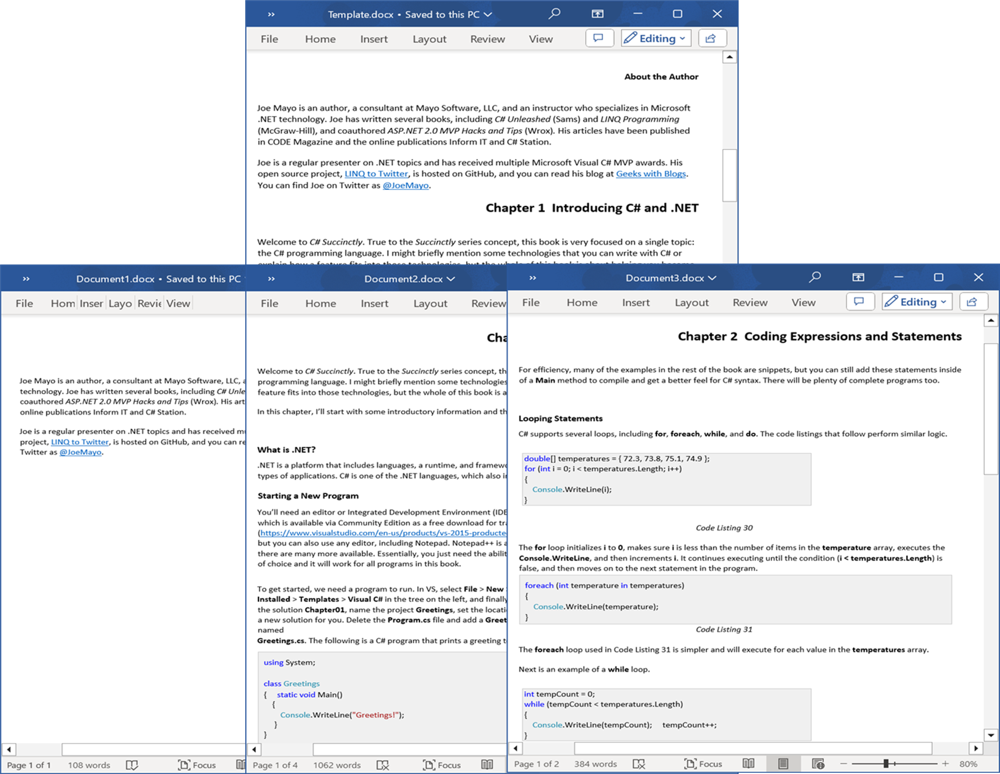

# Split Word documents in C#

This repository contains examples that illustrates how to split Word document programmatically in C#. The Syncfusion [.NET Word library](https://www.syncfusion.com/document-processing/word-framework/net/word-library?utm_source=github&utm_medium=listing&utm_campaign=github-docio-examples) (DocIO) split Word document with just few lines of code and also it does not require Microsoft Word application to be installed in the machine.

 
 

## Key Features
- [Split by Sections](Split-Word-document-by-sections/) - Split the Word document based on sections.
- [Split by Headings](Split-Word-document-by-headings/) - Split the Word document based on headings.
- [Split by Bookmarks](Split-Word-document-by-bookmarks/) - Split the Word document based on bookmarks.
- [Split by Placeholder text](Split-Word-document-by-placeholders/) - Split the Word document based on placeholder text.

## Syncfusion .NET Word Library
The Syncfusion DocIO is a [.NET Word library](https://www.syncfusion.com/document-processing/word-framework/net/word-library?utm_source=github&utm_medium=listing&utm_campaign=github-docio-examples) allows you to add advanced Word document processing functionalities to any .NET application and does not require Microsoft Word application to be installed in the machine. It is a non-UI component that provides a full-fledged document instance model similar to the Microsoft Office COM libraries to iterate with the document elements explicitly and perform necessary manipulation. 

Take a moment to peruse the [documentation](https://help.syncfusion.com/document-processing/word/word-library/net/overview?utm_source=github&utm_medium=listing&utm_campaign=github-docio-examples), where you can find basic Word document processing options along with the features like [mail merge](https://help.syncfusion.com/document-processing/word/word-library/net/working-with-mail-merge?utm_source=github&utm_medium=listing&utm_campaign=github-docio-examples), [merge](https://help.syncfusion.com/document-processing/word/word-library/net/word-document/merging-word-documents?utm_source=github&utm_medium=listing&utm_campaign=github-docio-examples), [split](https://help.syncfusion.com/document-processing/word/word-library/net/word-document/split-word-documents?utm_source=github&utm_medium=listing&utm_campaign=github-docio-examples) and [compare documents](https://help.syncfusion.com/document-processing/word/word-library/net/word-document/compare-word-documents?utm_source=github&utm_medium=listing&utm_campaign=github-docio-examples), [find and replace](https://help.syncfusion.com/document-processing/word/word-library/net/working-with-find-and-replace?utm_source=github&utm_medium=listing&utm_campaign=github-docio-examples) text in the Word document, [protect](https://help.syncfusion.com/document-processing/word/word-library/net/working-with-security?utm_source=github&utm_medium=listing&utm_campaign=github-docio-examples) the Word documents, and most importantly, the [PDF](https://help.syncfusion.com/document-processing/word/conversions/word-to-pdf/overview?utm_source=github&utm_medium=listing&utm_campaign=github-docio-examples) and [Image](https://help.syncfusion.com/document-processing/word/conversions/word-to-image/overview?utm_source=github&utm_medium=listing&utm_campaign=github-docio-examples) conversions with code examples.

Compatible Microsoft Word Versions
----------------------------------

*   Microsoft Word 97-2003
*   Microsoft Word 2007
*   Microsoft Word 2010
*   Microsoft Word 2013
*   Microsoft Word 2016
*   Microsoft Word 2019
*   Microsoft 365

Supported File Formats
----------------------

*   Creates, reads, and edits popular text file formats like [DOC](https://help.syncfusion.com/document-processing/word/word-library/net/word-file-formats#doc-to-docx-and-docx-to-doc?utm_source=github&utm_medium=listing&utm_campaign=github-docio-examples), DOT, [DOCM](https://help.syncfusion.com/document-processing/word/word-library/net/word-file-formats#macros?utm_source=github&utm_medium=listing&utm_campaign=github-docio-examples), DOTM, [DOCX](https://help.syncfusion.com/document-processing/word/word-library/net/word-file-formats#doc-to-docx-and-docx-to-doc?utm_source=github&utm_medium=listing&utm_campaign=github-docio-examples), [DOTX](https://help.syncfusion.com/document-processing/word/word-library/net/word-file-formats#templates?utm_source=github&utm_medium=listing&utm_campaign=github-docio-examples), [HTML](https://help.syncfusion.com/document-processing/word/word-library/net/html?utm_source=github&utm_medium=listing&utm_campaign=github-docio-examples), [RTF](https://help.syncfusion.com/document-processing/word/word-library/net/rtf?utm_source=github&utm_medium=listing&utm_campaign=github-docio-examples), [TXT](https://help.syncfusion.com/document-processing/word/word-library/net/text?utm_source=github&utm_medium=listing&utm_campaign=github-docio-examples), and [XML (WordML)](https://help.syncfusion.com/document-processing/word/word-library/net/word-file-formats#word-processing-xml-xml?utm_source=github&utm_medium=listing&utm_campaign=github-docio-examples).
*   Converts Word documents also to [PDF](https://help.syncfusion.com/document-processing/word/conversions/word-to-pdf/overview?utm_source=github&utm_medium=listing&utm_campaign=github-docio-examples), [Image](https://help.syncfusion.com/document-processing/word/conversions/word-to-image/overview?utm_source=github&utm_medium=listing&utm_campaign=github-docio-examples), and [ODT](https://help.syncfusion.com/document-processing/word/word-library/net/word-to-odt?utm_source=github&utm_medium=listing&utm_campaign=github-docio-examples) files.

## How to run the examples
- Download this project to a location in your disk.
- Open the solution file using Visual Studio.
- Rebuild the solution to install the required NuGet packages.
- Run the application.

## Resources

- **Product page:** [Syncfusion Word Framework](https://www.syncfusion.com/document-processing/word-framework/net?utm_source=github&utm_medium=listing&utm_campaign=github-docio-examples)
- **Documentation:** [Split Word document using Syncfusion Word library](https://help.syncfusion.com/document-processing/word/word-library/net/word-document/split-word-documents?utm_source=github&utm_medium=listing&utm_campaign=github-docio-examples)
- **GitHub Examples:** [Syncfusion Word library examples](https://github.com/SyncfusionExamples/DocIO-Examples?utm_source=github&utm_medium=listing&utm_campaign=github-docio-examples)
- **Online demo:** [Syncfusion Word library - Online demos](https://ej2aspnetcore.azurewebsites.net/aspnetcore/word/splitbysection#/material3?utm_source=github&utm_medium=listing&utm_campaign=github-docio-examples)

## Support and feedback
For any other queries, reach our [Syncfusion support team](https://support.syncfusion.com/?utm_source=github&utm_medium=listing&utm_campaign=github-docio-examples) or post the queries through the [community forums](https://www.syncfusion.com/forums?utm_source=github&utm_medium=listing&utm_campaign=github-docio-examples).

Request new feature through [Syncfusion feedback portal](https://www.syncfusion.com/feedback?utm_source=github&utm_medium=listing&utm_campaign=github-docio-examples).

## License
This is a commercial product and requires a paid license for possession or use. Syncfusion's licensed software, including this component, is subject to the terms and conditions of [Syncfusion's EULA](https://www.syncfusion.com/license/studio/22.2.5/syncfusion_essential_studio_eula.pdf?utm_source=github&utm_medium=listing&utm_campaign=github-docio-examples). You can purchase a licnense [here](https://www.syncfusion.com/sales/products?utm_source=github&utm_medium=listing&utm_campaign=github-docio-examples) or start a free 30-day trial [here](https://www.syncfusion.com/account/manage-trials/start-trials?utm_source=github&utm_medium=listing&utm_campaign=github-docio-examples).